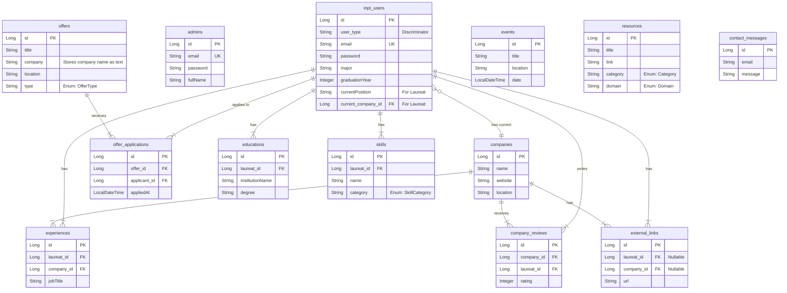

# INE Alumni Backend - Architecture Diagrams (Mermaid)

## 1. High-Level System Architecture

## 2. Security Flow

## 3. Authentication Flow

## 4. Alumni Search & Filter Flow

## 5. Entity Relationship Diagram (Corrected)

> **Note:** This diagram represents the actual database tables and their relationships.
> - `inpt_users` uses Single Table Inheritance: it stores `Laureat` and `Ine` users, differentiated by a `user_type` column.
> - `admins` is a separate table for `Admin` users. Both inherit fields from the `User` MappedSuperclass.
> - `Offer` is decoupled from `Company`; it stores the company name as a text field, not a foreign key.
> - Enums (like Role, Major, etc.) are attributes on the tables, not separate tables.

## 6. Component Diagram

## 7. Deployment Diagram

## 8. Data Model Class Diagram (Corrected)

> **Note:** This diagram shows the actual class inheritance and composition structure as defined in the Java code.
> - `User` is an abstract `@MappedSuperclass`.
> - `InptUser` and `Admin` are concrete `@Entity` classes that inherit from `User`.
> - `Laureat` and `Ine` inherit from `InptUser` and are part of a `@SingleTable` inheritance strategy.
> - Properties like `Role`, `Major`, `Permission` are `enum` types, not distinct classes.

## 9. State Diagram - Offer Application

## 10. Activity Diagram - User Registration

